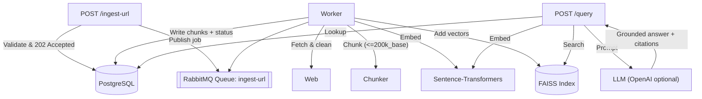

This project implements a retrieval-augmented generation (RAG) system that ingests web content asynchronously and answers user queries with grounded, cited information.

- **Asynchronous ingestion** via **RabbitMQ**
- **Metadata** in **PostgreSQL**
- **Semantic search** via **FAISS**
- **Token-aware chunking** using `tiktoken` **o200k_base**
- **Local embeddings** using Sentence-Transformers (with optional OpenAI LLM for answers)

---

## Architecture


---


## Why these choices?

RabbitMQ: durable queues, easy scaling.

PostgreSQL: reliable, easy to query, index, and scale.

FAISS: high-performance ANN (exact IndexFlatIP here) with simple persistence (more experience using).

o200k_base tokenizer: modern, compact.

Sentence-Transformers: runs locally by default (no external dependency), swap models easily.

---
## Layout
webrag/
  ├─ app/
  │  ├─ __init__.py
  │  ├─ api.py                 # FastAPI app (POST /ingest-url, POST /query, GET /ingestions/{id}, GET /health)
  │  ├─ config.py              # Settings via env vars
  │  ├─ db.py                  # SQLAlchemy engine/session/base
  │  ├─ models.py              # SQLAlchemy models (Ingestion, Chunk)
  │  ├─ schemas.py             # Pydantic request/response models
  │  ├─ queue.py               # RabbitMQ publisher helper
  │  ├─ fetcher.py             # Robust web fetch + content extraction (trafilatura + bs4 fallback)
  │  ├─ chunker.py             # Token-based chunking with tiktoken "o200k_base"
  │  ├─ embeddings.py          # Sentence-Transformers wrapper (+ normalization)
  │  ├─ vectorstore.py         # FAISS index wrapper with file locking
  │  ├─ llm.py                 # LLM answer synthesis (OpenAI optional, safe fallback)
  │  └─ utils.py               # small helpers
  ├─ worker/
  │  └─ worker.py              # RabbitMQ consumer: fetch → chunk → embed → index → persist
  ├─ scripts/
  │  └─ init_db.py             # Create tables if they don't exist
  ├─ data/                     # created at runtime (faiss index + lock live here)
  ├─ .env.example
  ├─ requirements.txt
  └─ README.md

---
## API's

• POST `/ingest-url`

```bash
http POST :8000/ingest-url url={url}
```
or

```bash
curl -X POST http://localhost:8000/ingest-url \
  -H "Content-Type: application/json" \
  -d '{"url":"https://example.com"}'
```
• GET `/ingestions/{id}`

```bash
curl http://localhost:8000/ingestions/{id}
```

• POST `/query`

```bash
http POST http://localhost:8000/query query="{query}"
```
or
```bash
curl -X POST http://localhost:8000/query \
  -H "Content-Type: application/json" \
  -d '{"query":"Summarize the main points.","top_k":5}'http POST http://localhost:8000/query query="{query}"
```

---
## Setup

• Prereqs:
    Python 3.10+
    PostgreSQL
    RabbitMQ

1. Clone repo
```bash
git clone https://github.com/GluStu/webrag.git
cd webrag
python -m venv .venv
source .venv/bin/activate
pip install -r requirements.txt
```

2. Configure environment

    Edit .env with your DB and RabbitMQ URLs
    Postgres example:
    ```bash
    createdb ragdb
    psql -d ragdb -c "CREATE USER raguser WITH PASSWORD 'ragpass';"
    psql -d ragdb -c "GRANT ALL PRIVILEGES ON DATABASE ragdb TO raguser;"
    ```

    copy .env.example to .env

    ```bash 
    cp .env.example .env
    ```

3. Initialize DB

    ```bash
    python -m scripts.init_db
    ```

4. Start services
    API
    ```bash
    uvicorn app.api:app --reload --port 8000
    ```
    Worker
    ```
    python -m worker.worker
    ```

5. LLM Setup
    Put your Gemini API key in the .env file

---

## Example queries

```bash
http POST :8000/ingest-url url={url}
```
```bash
curl http://localhost:8000/ingestions/{id}
```
```bash
http POST http://localhost:8000/query query="{query}"
```
